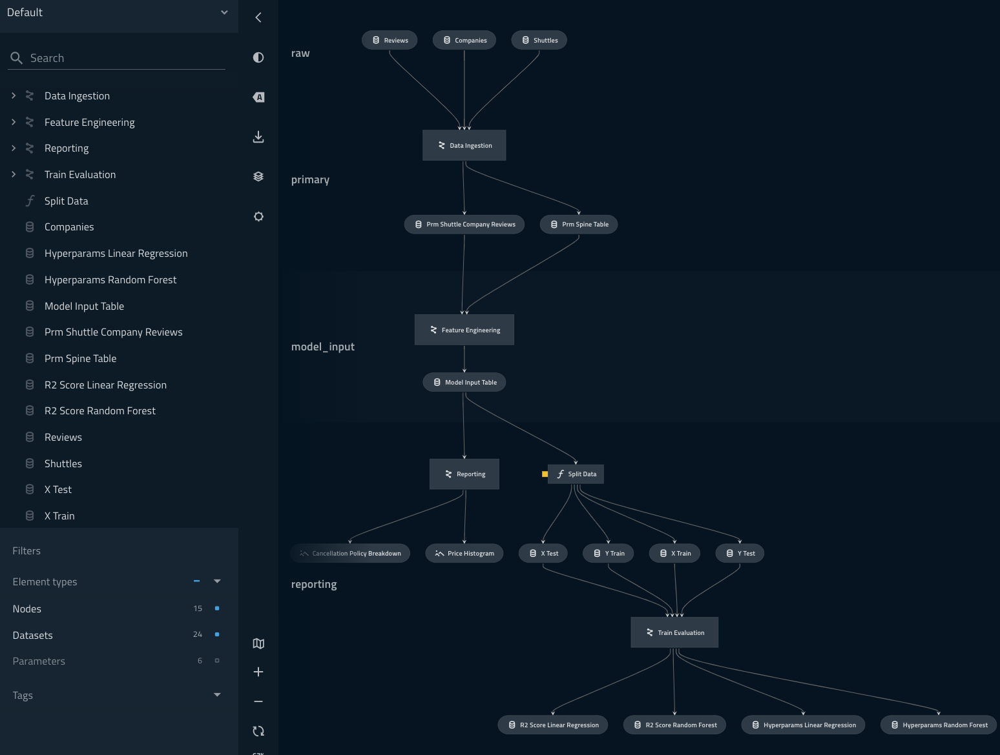

# modular-spaceflights

This project is designed to be a realistic example of what Kedro looks like when used in anger.

## Setup

1. Create a new virtual environment by calling `make env`
2. Activate new `mod-spaceflights` environment
3. Run `pip install kedro==0.17.5`
4. Run `kedro build-reqs`
5. Run `kedro install`
6. Run `kedro run` 
7. Run `kedro viz`

## Visualised output

