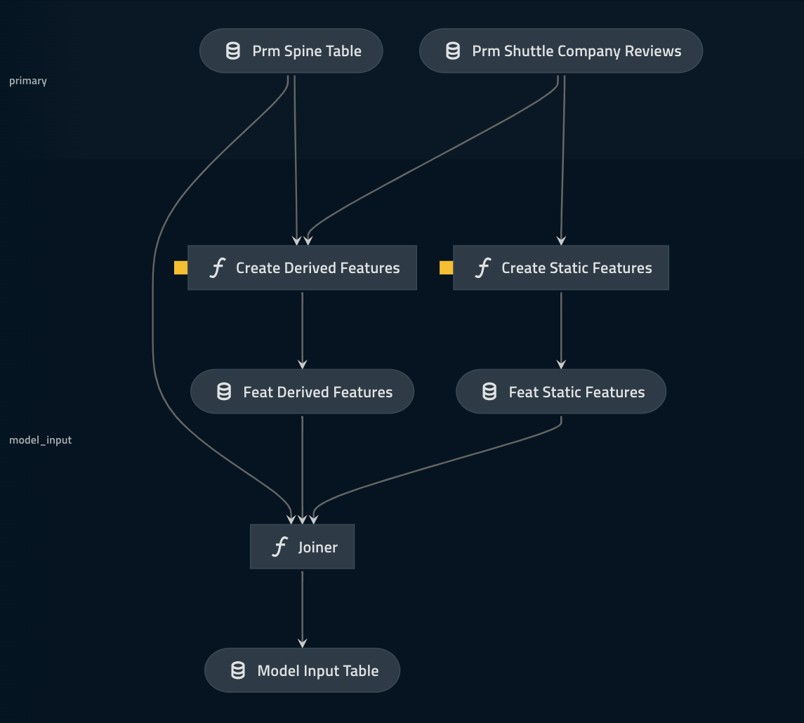

# Feature engineering pipeline

> *Note:* This `README.md` was generated using `Kedro 0.17.5` for illustration purposes. Please modify it according to your pipeline structure and contents.

This pipeline creates features from two different sources:

* Simple approach - There are metric columns already in the `prm_shuttle_company_reviews` table that are ready to go and are included in the `joiner` operation.
* Complex approach - Two parametrised instances of `Feature Maker` pipeline are created to create:
  * Scaled metrics are pairs of columns multiplied by each other.
  * Weighted metrics are paris of columns divided by each other.

> Look out for the '🟨 ' in Kedro Viz it means that parameters are applied to this node. You can inspect them on the sidebar by clicking the node.

* The `joiner` node has been written in a way that it will keep inner joining an arbitrary sequence of pandas DataFrame objects into one single table. It will fail if the number of rows changes during this operation. This operation creates out `model_input_table` which will be fundamental to analytical components downstream.

## Visualisation

